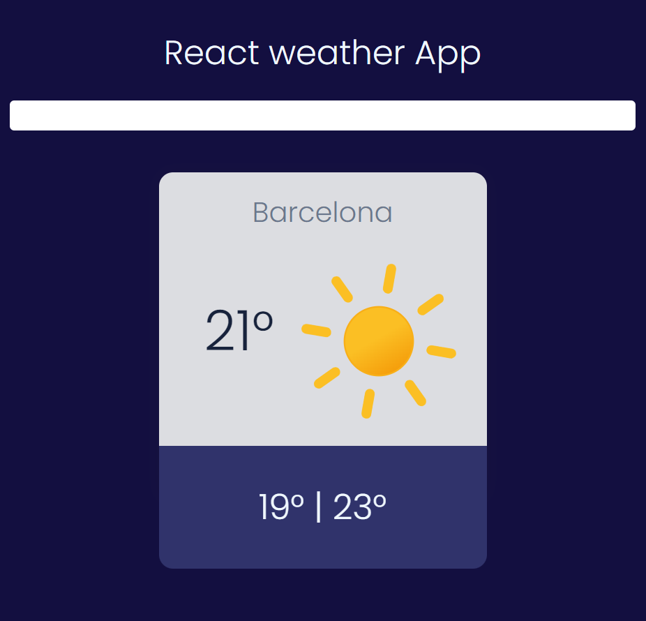

## Weather App

Develop a weather app with animated icons from [ Meteocons](https://bas.dev/work/meteocons), using React and the [OpenWeather](https://openweathermap.org/) Map API.

## 🚀Deployment:

[Deploy](https://6704f92f446fab1779e33517--tiempo-react-app.netlify.app/)
